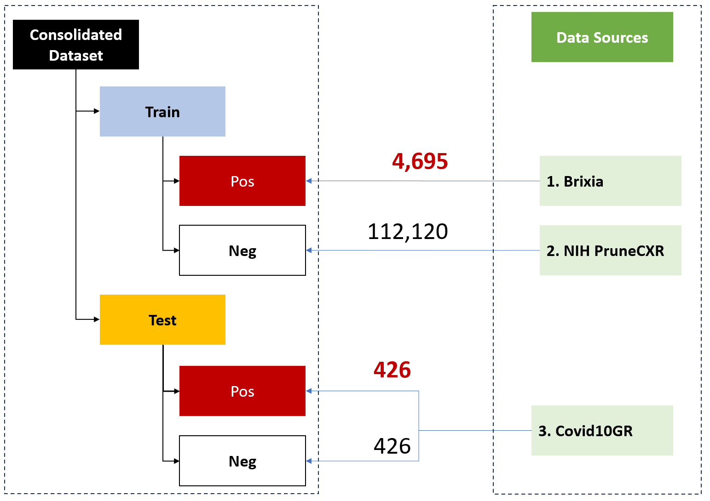
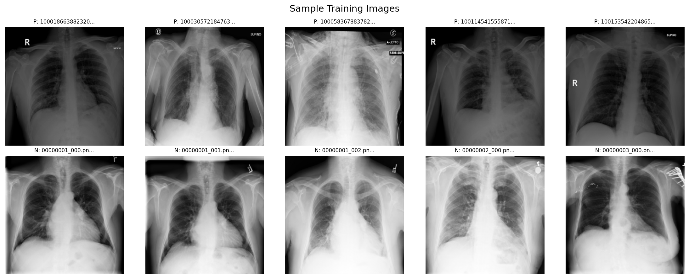
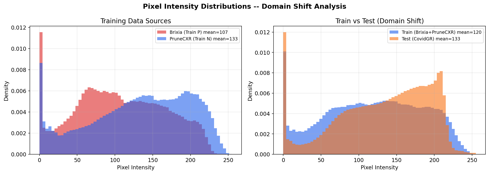
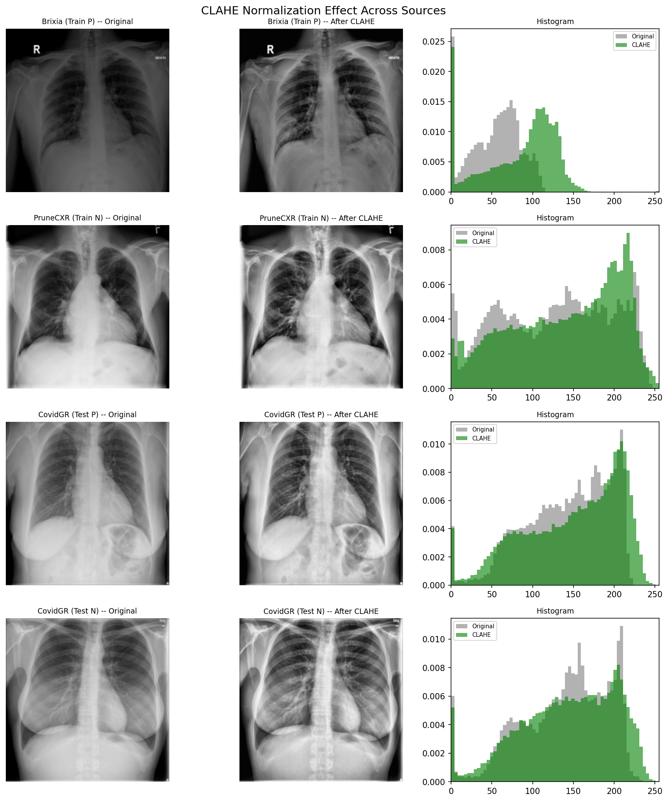
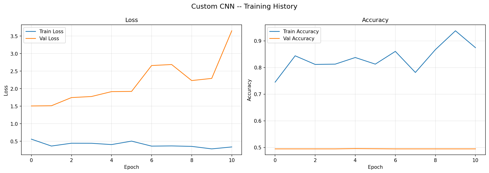
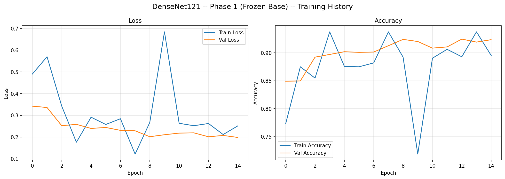
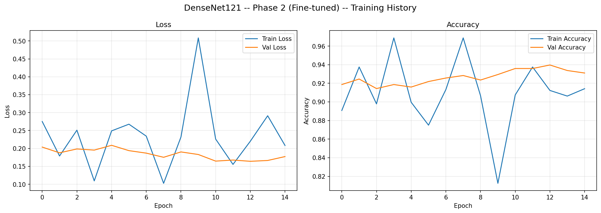
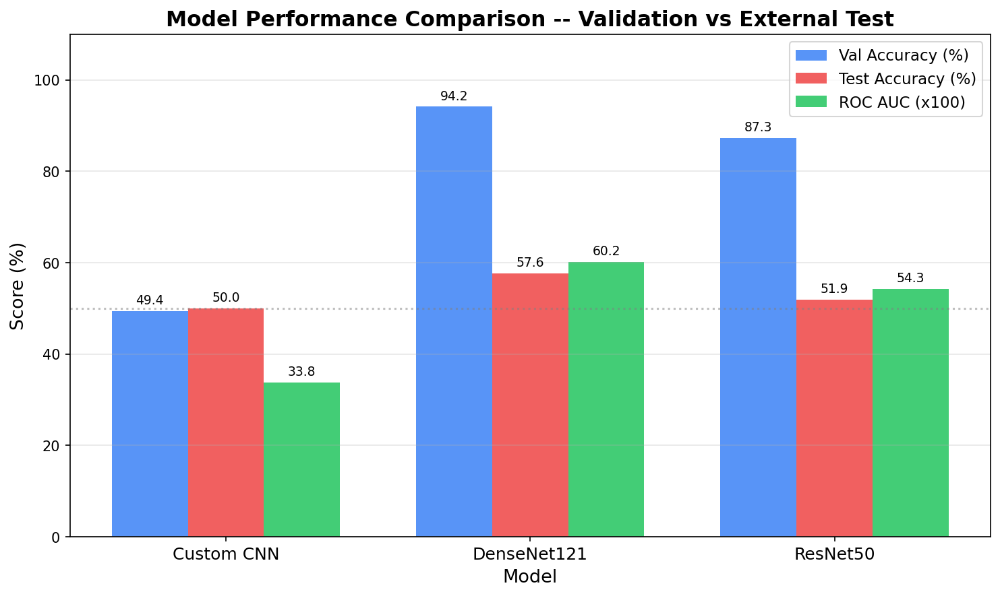
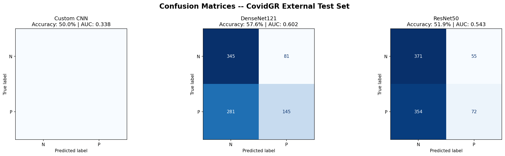
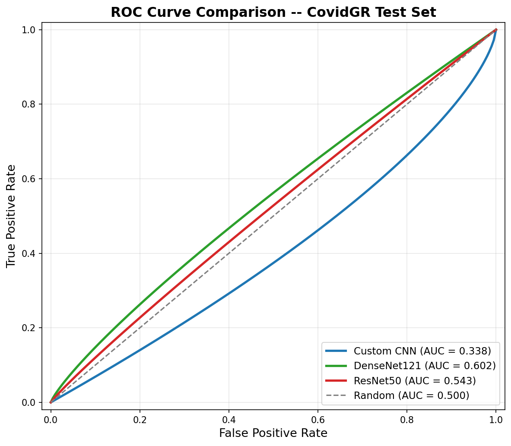

<div align="center">

# COVID-19 Chest X-Ray Classification

[](https://react.dev)
[](https://typescriptlang.org)
[](https://www.tensorflow.org/js)
[](https://www.tensorflow.org)
[](https://tailwindcss.com)
[](https://vite.dev)
[](https://docs.opencv.org)
[](https://python.org)
[](https://pages.github.com)

[](https://supergokou.github.io/Detection-of-COVID-19-from-X-Ray-Images/)

**Binary classification of COVID-19 from chest X-ray images using deep learning.**

Three models -- Custom CNN, DenseNet121, and ResNet50 -- trained on multi-source hospital data, evaluated on an external test set, and deployed as a fully client-side web app with TensorFlow.js.

No images ever leave your browser.

</div>

---

## Table of Contents

- [Overview](#overview)
- [Dataset](#dataset)
- [Preprocessing Pipeline](#preprocessing-pipeline)
- [Model Architectures](#model-architectures)
- [Training Configuration](#training-configuration)
- [Training Results](#training-results)
- [Evaluation Results](#evaluation-results)
- [Web Application](#web-application)
- [Project Structure](#project-structure)
- [Getting Started](#getting-started)
- [Bugs Fixed from Original Pipeline](#bugs-fixed-from-original-pipeline)
- [Disclaimer](#disclaimer)
- [References](#references)

---

## Overview

This project builds an end-to-end pipeline for detecting COVID-19 from posterior-anterior (PA) chest X-ray images:

1. **Data consolidation** from three independent clinical datasets across two countries
2. **CLAHE preprocessing** to normalize contrast across different hospital imaging equipment
3. **Training three architectures** with different complexity/performance tradeoffs
4. **External validation** on a held-out dataset from a different hospital system
5. **Web deployment** where all inference runs in the browser

The classification task is binary: **POSITIVE** (COVID-19 detected) vs. **NEGATIVE** (no COVID-19).

---

## Dataset

### Data Sources

| # | Dataset | Origin | Role | Format | Count |
|---|---------|--------|------|--------|-------|
| 1 | **Brixia** | Italian hospitals | Training (positive) | DICOM | 4,695 |
| 2 | **NIH PruneCXR** | NIH Clinical Center, USA | Training (negative) | PNG/JPG | 4,695 (sampled from 112,120) |
| 3 | **CovidGR 1.0** | Spanish hospitals | External test set | PNG | 852 |

<div align="center">
  
  <br />
  <em>Dataset consolidation flow -- training data from Brixia and NIH PruneCXR, external test data from CovidGR</em>
</div>

### Data Composition

```
Training Set (80/20 split, seed=42):
  Train:      7,512 images  (3,756 Positive + 3,756 Negative)
  Validation: 1,878 images  (  939 Positive +   939 Negative)

External Test Set (CovidGR):
  Test:         852 images  (  426 Positive +   426 Negative)
```

All splits are perfectly balanced at a 1:1 ratio. Images resized to **224 x 224** pixels.

### Sample Training Images

<div align="center">
  
  <br />
  <em>Top: COVID-positive X-rays (Brixia, Italy) -- Bottom: COVID-negative X-rays (PruneCXR, NIH)</em>
</div>

### Domain Shift Challenge

Training and test data come from different hospital systems with different imaging equipment. This creates measurable pixel intensity differences:

| Source | Mean | Std | Role |
|--------|------|-----|------|
| Brixia (Italy) | 107.4 | 59.5 | Train positive |
| PruneCXR (USA) | 133.3 | 64.7 | Train negative |
| CovidGR (Spain) | 133.4 | 60.3 | Test |

<div align="center">
  
  <br />
  <em>Pixel intensity distributions reveal systematic differences between hospital imaging systems</em>
</div>

---

## Preprocessing Pipeline

### CLAHE Contrast Normalization

**CLAHE** (Contrast Limited Adaptive Histogram Equalization) is applied to every image before training and inference to mitigate domain shift.

```
Parameters:  clipLimit = 2.0,  tileGridSize = (8, 8)
```

| Path | Steps |
|------|-------|
| **Grayscale** (Custom CNN) | Normalize 0-255 -> CLAHE -> Rescale to [0,1] |
| **RGB** (DenseNet/ResNet) | Normalize 0-255 -> RGB to YUV -> CLAHE on Y channel -> YUV to RGB -> Rescale to [0,1] |

<div align="center">
  
  <br />
  <em>CLAHE before/after comparison across all four data splits with histogram analysis</em>
</div>

### Data Augmentation (Training Only)

| Parameter | Value | Rationale |
|-----------|-------|-----------|
| Rotation | +/- 10 deg | Patient positioning variation |
| Width/Height shift | +/- 10% | Lateral/vertical positioning |
| Zoom | +/- 10% | Patient-detector distance |
| Brightness | 0.8 - 1.2 | Exposure variation |
| Horizontal flip | **Disabled** | Chest anatomy is not symmetric |

Test and validation sets receive **CLAHE + rescale only** (no augmentation).

---

## Model Architectures

### Custom CNN (Grayscale)

```
Input: 224 x 224 x 1

Block 1:  Conv2D(32, 3x3) -> BatchNorm -> ReLU -> MaxPool -> Dropout(0.25)
Block 2:  Conv2D(64, 3x3) -> BatchNorm -> ReLU -> MaxPool -> Dropout(0.25)
Block 3:  Conv2D(128, 3x3) -> BatchNorm -> ReLU -> MaxPool -> Dropout(0.25)
Block 4:  Conv2D(256, 3x3) -> BatchNorm -> ReLU -> MaxPool -> Dropout(0.25)

Head:     GAP -> Dense(256) -> BatchNorm -> ReLU -> Dropout(0.5) -> Dense(1, sigmoid)

Regularization: L2(1e-4) on all Conv2D and Dense kernels
```

### DenseNet121 (Transfer Learning)

```
Base:     DenseNet121 (ImageNet weights)
Head:     GAP -> Dense(256, ReLU) -> BatchNorm -> Dropout(0.5) -> Dense(1, sigmoid)

Phase 1:  Base frozen, train head only        (15 epochs, lr=1e-4)
Phase 2:  Unfreeze last 30 layers, fine-tune  (15 epochs, lr=1e-5)
```

### ResNet50 (Transfer Learning)

```
Base:     ResNet50 (ImageNet weights)
Head:     GAP -> Dense(256, ReLU) -> BatchNorm -> Dropout(0.5) -> Dense(1, sigmoid)

Phase 1:  Base frozen, train head only        (15 epochs, lr=1e-4)
Phase 2:  Unfreeze last 30 layers, fine-tune  (15 epochs, lr=1e-5)
```

### Model Comparison

| Model | Input | Parameters | TF.js Size | Training Strategy |
|-------|-------|-----------|------------|-------------------|
| **Custom CNN** | 224x224x1 | ~4.6M | ~2.7 MB | From scratch, 50 epochs |
| **DenseNet121** | 224x224x3 | ~7.1M | ~15 MB | Transfer learning, 2-phase (30 epochs) |
| **ResNet50** | 224x224x3 | ~23.5M | ~50 MB | Transfer learning, 2-phase (30 epochs) |

---

## Training Configuration

| Parameter | Value |
|-----------|-------|
| Image size | 224 x 224 |
| Batch size | 32 |
| Optimizer | Adam |
| Loss | Binary cross-entropy |
| Validation split | 80/20 |
| Class weights | Balanced (1.0 : 1.0) |
| Seed | 42 |

**Callbacks:** EarlyStopping (patience=10), ReduceLROnPlateau (factor=0.5, patience=5), ModelCheckpoint (best val_loss)

---

## Training Results

Training history curves showing loss and accuracy over epochs for each model. Generated by `covid19project.ipynb`.

### Custom CNN

<div align="center">
  
  <br />
  <em>Custom CNN -- training and validation loss/accuracy over 50 epochs</em>
</div>

### DenseNet121

<div align="center">
  
  <br />
  <em>DenseNet121 Phase 1 -- frozen base, training head only (15 epochs)</em>
</div>

<div align="center">
  
  <br />
  <em>DenseNet121 Phase 2 -- fine-tuning last 30 layers (15 epochs)</em>
</div>

### ResNet50

<div align="center">
  
  <br />
  <em>ResNet50 Phase 1 -- frozen base, training head only (15 epochs)</em>
</div>

<div align="center">
  
  <br />
  <em>ResNet50 Phase 2 -- fine-tuning last 30 layers (15 epochs)</em>
</div>

---

## Evaluation Results

All models evaluated on the **CovidGR external test set** (852 images, never seen during training).

### Validation Performance (Same-Source)

| Model | Best Epoch | Val Loss | Val Accuracy |
|-------|-----------|----------|-------------|
| Custom CNN | 4 | 1.9510 | 49.41% |
| DenseNet121 Phase 1 | 15 | 0.1808 | 93.16% |
| DenseNet121 Phase 2 | 11 | 0.1555 | **94.18%** |
| ResNet50 Phase 1 | 15 | 0.4341 | 79.53% |
| ResNet50 Phase 2 | 9 | 0.2910 | 87.34% |

### Test Performance (Cross-Source, CovidGR)

| Model | Test Accuracy | Test Loss | ROC AUC |
|-------|:------------:|:---------:|:-------:|
| Custom CNN | 50.00% | 1.9861 | 0.338 |
| **DenseNet121** | **57.63%** | **1.2307** | **0.602** |
| ResNet50 | 51.88% | 1.3125 | 0.543 |

> **Note:** The gap between validation (up to 94%) and test (up to 58%) performance reflects the
> domain shift between training sources (Italian/American hospitals) and the external test set
> (Spanish hospitals). This is expected in cross-hospital medical imaging and motivates the CLAHE
> preprocessing strategy. DenseNet121 shows the strongest generalization.

### Model Performance Comparison

<div align="center">
  
  <br />
  <em>Validation accuracy (same-source) vs test accuracy (cross-source) highlights the domain shift gap</em>
</div>

### Per-Model Evaluation

Each model's confusion matrix and ROC curve on the CovidGR test set:

<div align="center">
  
  <br />
  <em>Custom CNN -- confusion matrix and ROC curve on CovidGR test set</em>
</div>

<div align="center">
  
  <br />
  <em>DenseNet121 -- confusion matrix and ROC curve on CovidGR test set</em>
</div>

<div align="center">
  
  <br />
  <em>ResNet50 -- confusion matrix and ROC curve on CovidGR test set</em>
</div>

### Combined Confusion Matrices

<div align="center">
  
  <br />
  <em>Confusion matrices on the CovidGR external test set (426 Positive + 426 Negative)</em>
</div>

### ROC Curve Comparison

<div align="center">
  
  <br />
  <em>DenseNet121 (AUC=0.602) shows the strongest generalization across hospital systems</em>
</div>

### Per-Model Classification Reports

**DenseNet121** (best performer):
```
              precision    recall  f1-score   support
           N       0.55      0.81      0.66       426
           P       0.64      0.34      0.45       426
    accuracy                           0.58       852
```

**ResNet50:**
```
              precision    recall  f1-score   support
           N       0.51      0.87      0.64       426
           P       0.56      0.17      0.26       426
    accuracy                           0.52       852
```

---

## Web Application

A fully client-side single-page application. All inference runs in the browser using TensorFlow.js and OpenCV.js WebAssembly.

### Tech Stack

<div align="center">

| Layer | Technology | Purpose |
|-------|-----------|---------|
|  | React + TypeScript | UI framework |
|  | Vite | Build tool |
|  | Tailwind CSS | Styling |
|  | TensorFlow.js | ML inference |
|  | OpenCV.js (WASM) | CLAHE preprocessing |
|  | Radix UI | Accessible components |
|  | GitHub Pages | Static hosting |

</div>

### Browser Inference Pipeline

```
Upload X-Ray  -->  Load Model (TF.js, lazy + cached)
                         |
                   Resize 224x224 (Canvas)
                         |
                   CLAHE (OpenCV.js WASM)
                         |
                   model.predict() --> sigmoid [0,1]
                         |
                   Threshold 0.5 --> POSITIVE / NEGATIVE
```

### Running Locally

```bash
cd Web
npm install
npm run dev
```

### Deploying

```bash
cd Web
npm run deploy    # builds + pushes to gh-pages branch
```

---

## Project Structure

```
Covid_Project/
  covid19project.ipynb              # Main training notebook (Google Colab)
  covid19_polished.ipynb            # Training notebook (local version)
  covid19_polished_colab.ipynb      # Training notebook (Colab version)
  covid19_run.py                    # Standalone training script
  utility.py                        # Image preprocessing utilities
  generate_readme_images.py         # Generate summary plots for README
  covid19_xrays_proposal.pdf        # Project proposal document
  models/                           # Trained Keras weights (.h5)
    best_custom_cnn.weights.h5
    best_densenet121_phase2.weights.h5
    best_resnet50_phase2.weights.h5
  results/                          # Training result plots (from notebook)
  original_data/                    # Raw datasets (not committed)
    Brixia/dicom/                   # 4,695 DICOM files
    PruneCXR_IMG/                   # NIH chest X-rays
    COVIDGR_1.0/{P,N}/              # External test set
  processed_data/                   # Preprocessed 224x224 images (not committed)
    train/{P,N}/
    test/{P,N}/
  Web/                              # Client-side web application
    public/
      images/                       # README figures and result plots
      models/                       # TF.js models (after conversion)
    src/
      components/                   # React UI components
      hooks/useClassifier.ts        # Inference state machine
      lib/
        model-manager.ts            # TF.js loading + prediction
        preprocessing.ts            # CLAHE (matches Python exactly)
      App.tsx
    scripts/convert_models.py       # Keras -> TF.js converter
    package.json
    vite.config.ts
```

---

## Getting Started

### Prerequisites

**Web app:** Node.js 18+, npm 9+

**Training:** Python 3.10+, TensorFlow 2.16+, OpenCV, NumPy, Pandas, Matplotlib, Scikit-learn

**Model conversion:** `pip install tensorflowjs`

### Training

```bash
python covid19_run.py
# or use covid19project.ipynb on Google Colab
```

Weights saved to `models/`:
- `best_custom_cnn.weights.h5`
- `best_densenet121_phase2.weights.h5`
- `best_resnet50_phase2.weights.h5`

Result plots saved to `results/` and copied to `Web/public/images/`.

### Converting Models for the Web

```bash
cd Web
python scripts/convert_models.py
```

The script auto-detects weight files in `../models/`. Outputs TF.js graph models with float16 quantization to `public/models/`.

---

## Bugs Fixed from Original Pipeline

| # | Bug | Impact | Fix |
|---|-----|--------|-----|
| 1 | `steps_per_epoch` divided by extra 16x | Model saw <1% of data per epoch | `samples // batch_size` |
| 2 | SigmoidFocalCrossEntropy + softmax | Loss/activation mismatch | BinaryCrossentropy + sigmoid |
| 3 | Augmentation on test data | Corrupted evaluation metrics | Test uses rescale only |
| 4 | OCR filter removed 95% of positives | 24:1 imbalance, model collapse | Removed filter, balanced 1:1 |
| 5 | Val accuracy collapsed to 0.0 | No training signal | Fixed by bugs 1 + 4 |
| 6 | 512x512 images | Wasteful compute | 224x224 (ImageNet standard) |

---

## Disclaimer

> This project is for **research and educational purposes only**. Not a medical diagnostic device. Not validated for clinical deployment. Always consult healthcare professionals for medical diagnoses. All inference runs locally -- no images are uploaded to any server.

---

## References

- **Brixia Dataset:** Signoroni, A. et al. -- Italian COVID-19 chest X-ray dataset
- **NIH CXR:** Wang, X. et al. "ChestX-ray8: Hospital-scale Chest X-ray Database and Benchmarks." *CVPR 2017*
- **CovidGR 1.0:** Tabik, S. et al. "COVIDGR Dataset and Optimized Deep Learning Approach." *Scientific Reports, 2020*
- **CLAHE:** Zuiderveld, K. "Contrast Limited Adaptive Histogram Equalization." *Graphics Gems IV, 1994*
- **DenseNet:** Huang, G. et al. "Densely Connected Convolutional Networks." *CVPR 2017*
- **ResNet:** He, K. et al. "Deep Residual Learning for Image Recognition." *CVPR 2016*
- **TensorFlow.js:** Smilkov, D. et al. "TensorFlow.js: Machine Learning for the Web and Beyond." *MLSys 2019*
